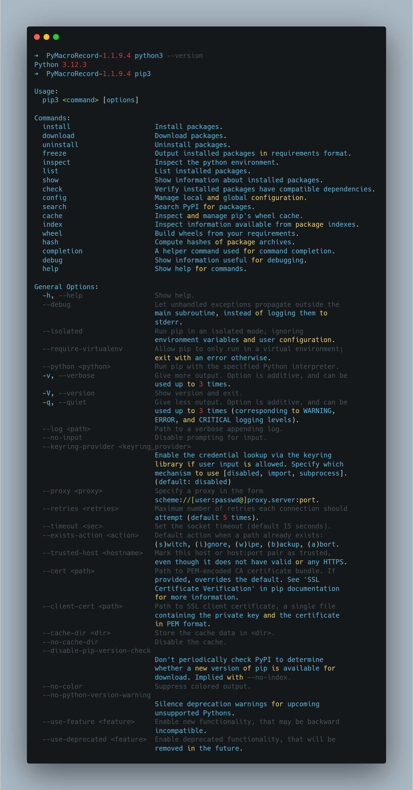
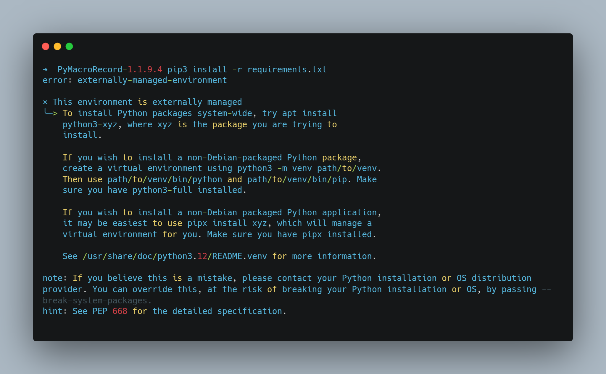
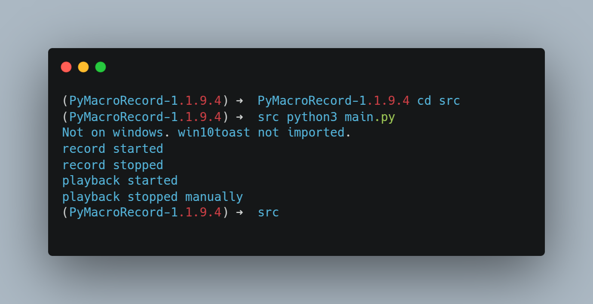

# PyMacroRecorder – Setup di Ubuntu (BIAR GAK PUYENG!)

## Apa Ini?
Jujur aja, gue juga gak tau kenapa bikin guide ini… Tapi ya, 

Doks asli: [di sini](https://github.com/LOUDO56/PyMacroRecord)
Website asli: [di sini](www.pymacrorecord.com/)

---

## Cara Install (Santai Aja, Gampang Kok... *Kayaknya*)

### **1. Pasang Python dulu!**
> Harus ada Python di sistem, kalau bisa yang paling baru atau LTS biar gak ribet. 
> Download [di sini](https://www.python.org/downloads/) terus install kayak biasa.



---

### **2. Download PyMacroRecorder**
> Buka halaman [release di GitHub](https://github.com/LOUDO56/PyMacroRecord/releases) dan download versi terbaru.
> Setelah download, **extract** file-nya.

---

### **3. Masuk ke Folder dan Install Dependensi**
Kalau baca dokumentasi aslinya, disuruh jalanin ini:

```bash
cd <PATH TO SOFTWARE FOLDER>
pip3 install -r requirements.txt
```
> **Masalahnya:** ini error!

 

---

### **4. Solusi Anti Error: Pakai Virtual Environment (venv)!**  
Biar gak ada drama, kita bikin environment virtual langsung di folder proyek.

```bash
virtualenv .
source bin/activate
```
> Sekarang Python dan pip udah keisolasi, jadi gak bentrok sama sistem.

---

### **5. Install Tkinter (Biar UI-nya Bisa Jalan!)**
> Install dulu Tkinternya.
> Ikuti panduan lengkapnya di sini: [Install Tkinter di Linux](https://www.pythonguis.com/installation/install-tkinter-linux/).

---

### **6. Jalankan Programnya!**
Setelah semua siap, masuk ke folder `src` dan gaskeun:

```bash
cd src
python3 main.py
```


---

## **FINAAAAL!** 🚀
> Sekarang tinggal dicoba. **TAPI PAS GUA COBA KOK MALAH GAK JALAN YA??** 🤡 

 

Pokoknya kalau ada error, jangan panik. Coba cek ulang langkah-langkahnya, atau serahkan ke yang lebih jago. 
**SEKIAN! SELAMAT MENCOBA & SEMOGA BERHASIL!** 🎉🔥
